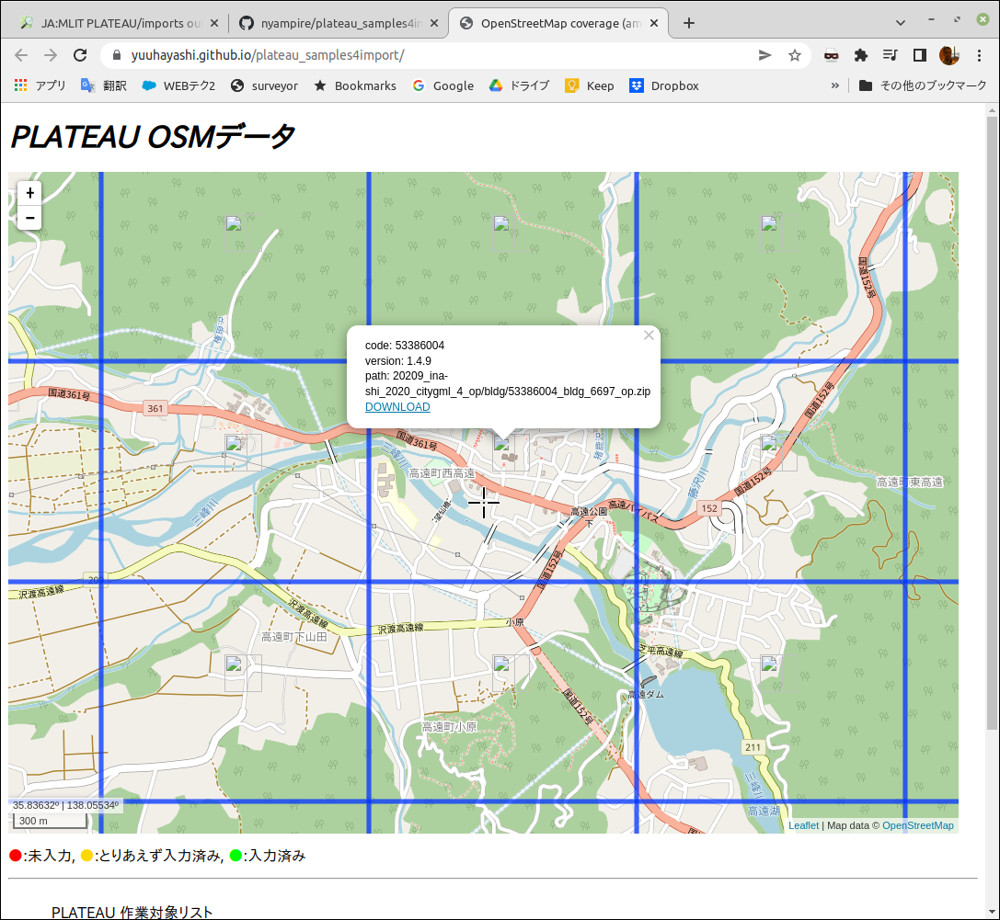

# plateau_samples4import
このデータは、現在OpenStreetMapへのインポートが提案され、議論段階にあるPlateau建物データについて、スクリプトでデータを変換した際のサンプルを提供するものです。

変換は2022年５月上旬に行われ、[スクリプト](https://github.com/yuuhayashi/citygml-osm)は[バージョン1.4.6](https://github.com/yuuhayashi/citygml-osm/releases/tag/v1.4.6)を利用しています。


## [配信サイト](http://surveyor.mydns.jp/osm-data/)

[配信サイト](http://surveyor.mydns.jp/osm-data/](http://surveyor.mydns.jp/osm-data/))



[配信サイト](http://surveyor.mydns.jp/osm-data/)で、PLATEAUの変換データをダウンロードすることができます。


## 配信ファイル

[配信サイト]([https://yuuhayashi.github.io/plateau_samples4import/](http://surveyor.mydns.jp/osm-data/))からダウンロードしたZIPファイルを解凍すると、以下4つのファイルが展開されます。

「「citygml-osm」を使った openStreetMap の編集方法」[How to Use](https://github.com/yuuhayashi/citygml-osm/wiki/How_to_use)

各ファイルは、[インポート作業手順](https://qiita.com/nyampire/items/1c10afdd36750c87154d)のなかで行う、1st, 2nd, 3rdのそれぞれのスクリプトを回した結果です。

```
  .
├── 0_original　　　　　　'53386086_bldg_6697_op.gml'
├── 1_just_convert         '53386086_bldg_6697_op.osm'
├── 2_downloaded_osm       '53386086_bldg_6697_op.org.osm'
├── 3_mechanical_merge     '53386086_bldg_6697_op.mrg.osm'
└── 4_ready4upload
```

* `0_original`: PlateauオリジナルのCityGMLファイルです
* `1_just_convert`: 1stの処理を行い、CityGMLをOSMデータに変換したファイルです
* `2_downloaded_osm`: 2ndの処理を行い、対象となるメッシュ地域の既存OSMデータをダウンロードしたものです
* `3_mechanical_merge`: 3rdの処理を行い、変換したPlateauデータと既存OSMデータのマージを行ったものです
* `4_ready4upload`: 4thの処理を行い、3rdの結果からOSMにアップロードできる状態に変換を行ったものです（注: 本来は手動の確認処理を行ってから4thの変換を行いますが、今回はその確認を行っていません）

それぞれのファイルにはメッシュ番号が記載されているため、同じメッシュ番号のファイルをJOSMに読み込ませることで、変換状況の比較が可能になります。

## whole-mergedファイルについて
対象市町村の全域の4thデータを、JOSMを使って合成したファイルです。

ただし、JOSMでのマージの際にいくつか競合が発生しており、無理やりマージを行っています。あくまでも概況を確認するためのものとしてお使いください。

[Backup-site](https://yuuhayashi.github.io/plateau_samples4import/) このGitHub。

